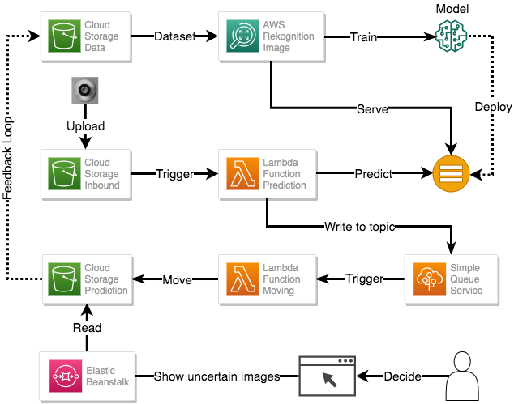
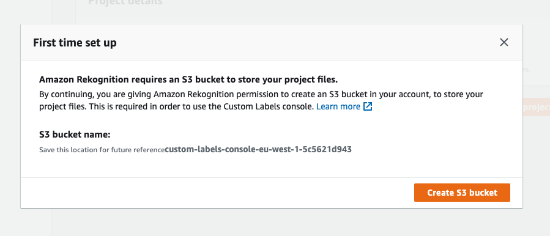
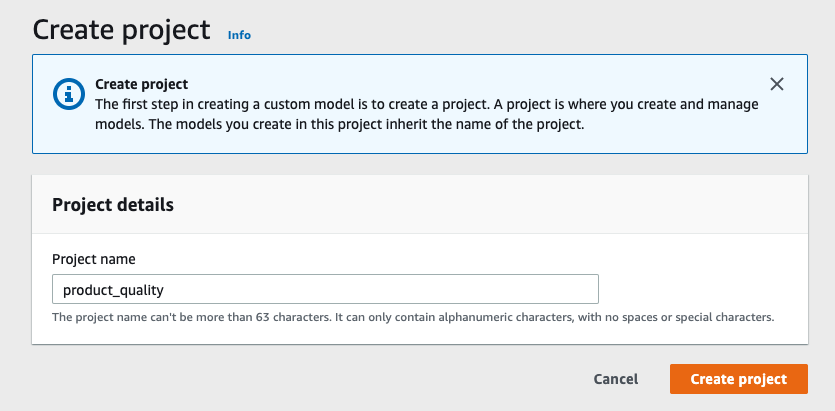
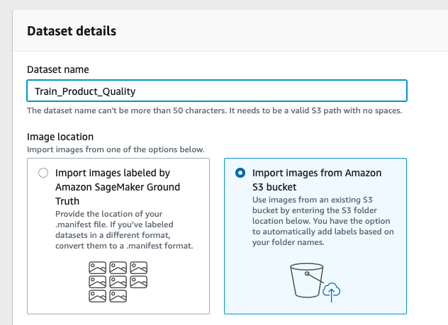
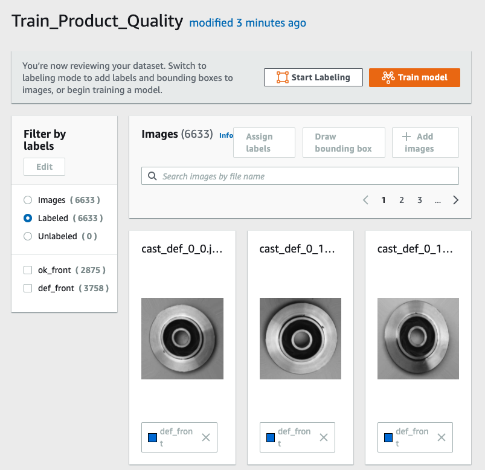
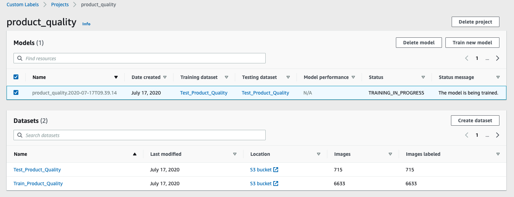
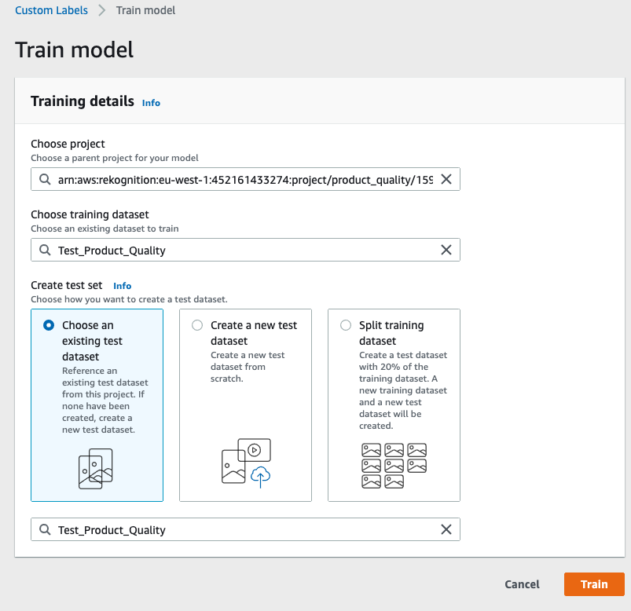
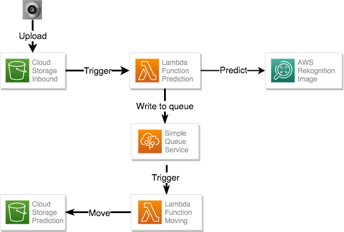

# Amazon Web Service Automated Quality Inspection


This repository is a showcase about how to leverage Amazon Web Services (aws) to train and deploy a machine learning project without any deep knowledge about machine learning frameworks. 
 The underlying use case is automated detection of defect components in manufacturing. For this purpose we upload pictures of the components to aws. Then, we classify the image using a machine learning model. Images that are not classified with sufficient certainty by the model can be manually postprocessed using a simple user interface.

We utilizing different services such as [S3](https://aws.amazon.com/s3/), [Rekognition](https://aws.amazon.com/rekognition/), [Lambda Functions](https://aws.amazon.com/lambda/), [Simple Queue Service](https://aws.amazon.com/sqs/) and [Elastic Beanstalk](https://aws.amazon.com/elasticbeanstalk/) to implement the machine learning system. The Rekognition image classification model is trained on the [product image data for quality insepection](https://www.kaggle.com/ravirajsinh45/real-life-industrial-dataset-of-casting-product).

## Amazon Rekognition

Using Amazon Rekognition Custom Labels.

Custom labels available in the Ireland region (eu-west-1).

1. First time setup -> rekognition create S3 bucket -> In our case: 
custom-labels-console-eu-west-1-5c5621d943

1. Create a project -> contains all the "management" details about images, labels and models

1. Create a dataset -> Automatically add labels based on folder names
[] Command to upload images to S3 via CLI
[] Otherwise drop and drop "casting_data" from the data folder into the S3 Bucket via AWS console.
Import the images from Amazaon S3 Bucket


We can inspect the dataset within the AWS Rekognition UI.

We will do the same with the test dataset and provide the S3 folder location as S3://$BUCKET/assets/casting_data/train
Finally the project overview should look like the following:

Start the training:

Downsides:
- Not possible to select time of training. Explain costs here
TODO: is there a notification after the training has finished?

Trainings results are impressive

## Run Rekognition Server
Cost model
1. Prerequisites:
    - setup IAM account `IAM` -> `Users` -> `Add user`
    - Add `AmazonRekognitionCustomLabelsFullAccess`-Role
    - Download csv file with credentials and setup the profile
1. Setup awscli locally `aws configure --profile product_quality`
1. `EXPORT AWS_PROFILE=product_quality`
1. 
aws rekognition start-project-version --project-version-arn "arn:aws:rekognition:eu-west-1:452161433274:project/product_quality/version/product_quality.2020-07-17T09.39.14/1594971554815" --min-inference-units 1 --region eu-west-1

2. Test progammtically:
aws rekognition detect-custom-labels \
  --project-version-arn "arn:aws:rekognition:eu-west-1:452161433274:project/product_quality/version/product_quality.2020-07-17T09.39.14/1594971554815" \
  --image '{"S3Object": {"Bucket": "custom-labels-console-eu-west-1-5c5621d943","Name": "assets/casting_data/test/ok_front/cast_ok_0_10.jpeg"}}' \
  --region eu-west-1

  3. With boto3
  ```
import boto3
session = boto3.session.Session(profile_name='product_quality')
client = session.client('rekognition')
response = client.detect_custom_labels(
    ProjectVersionArn='arn:aws:rekognition:eu-west-1:452161433274:project/product_quality/version/product_quality.2020-07-17T09.39.14/1594971554815',
    Image={
        'S3Object': {
            'Bucket': 'custom-labels-console-eu-west-1-5c5621d943',
            'Name': 'assets/casting_data/test/ok_front/cast_ok_0_10.jpeg',
        }
    },
)
  ```

## Lambda Integration



For our setup, we require two lambda functions. The first function classifies new images via the Rekognition model and publishes the prediction result to SQS. The second function takes the prediction results and distributes the inbound picturesaccordingly.

#### Preliminaries

Before we can deploy the lambda functions, we have to create a executioner role with adequate permissions. In a real production environment, we should satisfy the principle of least privilege. In this demo, however, we keep it simple and create one role for both functions.

First, we create the executioner role via

```
aws iam create-role --role-name lambda-ex --assume-role-policy-document '{"Version": "2012-10-17","Statement": [{ "Effect": "Allow", "Principal": {"Service": "lambda.amazonaws.com"}, "Action": "sts:AssumeRole"}]}'
```
Then, we add the policies `AWSLambdaFullAccess`, `AmazonSQSFullAccess` and `AmazonRekognitionCustomLabelsFullAccess` with

```
aws iam attach-role-policy --role-name lambda-ex --policy-arn arn:aws:iam::aws:policy/AWSLambdaFullAccess

aws iam attach-role-policy --role-name lambda-ex --policy-arn arn:aws:iam::aws:policy/AmazonSQSFullAccess

aws iam attach-role-policy --role-name lambda-ex --policy-arn arn:aws:iam::aws:policy/AmazonRekognitionCustomLabelsFullAccess
```
We attach this role to both lambda functions.

#### Prediction

The [predict](lambda_functions/predict/predict.py) function triggers for each picture that is uploaded to the inbound bucket. It sends the picture to the custom Rekognition model in order to obtain a prediction. The result of this classification is published to a SQS queue. We publish messages of the form.
```
msg = {
    "bucket_name": ,
    "image_name": ,
    "prediction_label": ,
    "prediction_score": ,
}
```
In order to deploy the function we require the environment variables
```
ACCOUNT_ID="<<my-account-id>>"
MODEL_ARN="<<my-rekognition-mode-arn"
INBOUND_BUCKET="<<my_prediction_bucket>>"
PREDICTION_QUEUE="<<my_prediction_queue>>"
PREDICT_LAMBDA_NAME="predict_picture"
```
Here, the `ACCOUNT_ID` is the ID of the aws account. The `MODEL_ARN` is the ARN of the custom Rekognition model of the previous step which can be found in the Rekognition UI. Whereas the names for the bucket `INBOUND_BUCKET` and SQS queue name `PREDICTION_QUEUE` can be chosen freely. The value for `PREDICT_LAMBDA_NAME` doesn't have to be changed.

We create the bucket and the SQS queue with
```
aws s3 mb s3://${INBOUND_BUCKET}
```
and
```
SQS_QUEUE_URL=$(aws sqs create-queue --queue-name ${PREDICTION_QUEUE} --query "QueueUrl")
```
Here, we store the `SQS_QUEUE_URL` for later. Then, we zip the code for the lambda function with
```
cd lambda_functions/predict
zip predict_function.zip predict.py
cd ../..
```
and finally deploy the lambda using
```
aws lambda create-function \
--function-name ${PREDICT_LAMBDA_NAME} \
--zip-file fileb://lambda_functions/predict/predict_function.zip \
--runtime python3.7 \
--role arn:aws:iam::452161433274:role/lambda-ex \
--handler predict.lambda_handler \
--environment Variables="{model_arn=${MODEL_ARN},sqs_queue=${PREDICTION_QUEUE}}"
```
Next, we have to give permission to the inbound bucket to trigger the lambda function
```
aws lambda add-permission \
--function-name ${PREDICT_LAMBDA_NAME} \
--action lambda:InvokeFunction \
--statement-id s3invoke \
--principal s3.amazonaws.com \
--source-arn arn:aws:s3:::${INBOUND_BUCKET} \
--source-account ${ACCOUNT_ID}
```
Then, we can add the event notification to the bucket
```
aws s3api put-bucket-notification-configuration \
 --bucket ${INBOUND_BUCKET} \
 --notification-configuration file://lambda_functions/s3triggerNotification.json
```
using [s3triggerNotification.json](lambda_functions/s3triggerNotification.json) with the correct arn for the lambda function.

#### Moving
The [move](lambda_functions/move/move.py) function triggers for new events on the SQS queue `PREDICTION_QUEUE`. The function moves the picture into the respective subfolder in the prediction bucket and deletes it from the inbound bucket. Here, we explicitly check if the prediction score is above a given threshold. We move images with low score into a special folder for manual postprocessing because we only trust predictions with a high score for automated processing. The resulting folder structure looks as follows.   
```
prediction_bucket
├── ok
│   └── new_pic_4566.jpeg
│   └── new_pic_2353.jpeg
│   └── ...
├── defect
│   └── new_pic_3546.jpeg
│   └── new_pic_2453.jpeg
│   └── ...
└── unclear
    └── new_pic_1452.jpeg
    └── new_pic_1245.jpeg
    └── ...
```

We require the following environment variables for deploying the function.
```
PREDICTION_BUCKET="<<my_prediction_bucket>"
PREDICTION_THRESHOLD="0.8"

MOVE_LAMBDA_NAME="move_picture"
```
Here, the name for the bucket `PREDICTION_BUCKET` can be chosen freely. The `PREDICTION_THRESHOLD` defines the threshold for predictions that we consider unclear. Again, the value for `MOVE_CF_NAME` doesn't have to be changed.

We create the prediction bucket with
```
aws s3 mb s3://${PREDICTION_BUCKET}
```
Then we zip the function code and deploy the function with
```
cd lambda_functions/move
zip move_function.zip move.py
cd ../..

aws lambda create-function \
--function-name ${MOVE_LAMBDA_NAME} \
--zip-file fileb://lambda_functions/move/move_function.zip \
--runtime python3.7 \
--role arn:aws:iam::452161433274:role/lambda-ex \
--handler move.lambda_handler \
--environment Variables="{prediction_bucket=${PREDICTION_BUCKET}, prediction_threshold=${PREDICTION_THRESHOLD}}"
```
Next, we have to create an event source mapping between the SQS queue and the function
```
SQS_QUEUE_ARN=$(aws sqs get-queue-attributes --queue-url ${SQS_QUEUE_URL//\"} --attribute-names All --query Attributes.QueueArn)

aws lambda create-event-source-mapping \
 --function-name ${MOVE_LAMBDA_NAME} \
 --batch-size 1 \
 --event-source-arn ${SQS_QUEUE_ARN//\"}
```
Here, we use the `SQS_QUEUE_URL` from above.

## Elastic Beanstalk

### Get right permissions
[] TODO get permission Screenshot

eb init -p python-3.7 product-quality-api --region eu-west-1

1. Create policy to access the s3 bucket and assign it the beanstalk service role:
```
{
    "Version": "2012-10-17",
    "Statement": [
        {
            "Effect": "Allow",
            "Action": [
                "s3:GetBucketLocation",
                "s3:ListAllMyBuckets"
            ],
            "Resource": "arn:aws:s3:::*"
        },
        {
            "Effect": "Allow",
            "Action": "s3:*",
            "Resource": [
                "arn:aws:s3:::product-quality-inbound"
            ]
        }
    ]
}
```

eb create product-quality-api --profile product_quality

eb deploy


