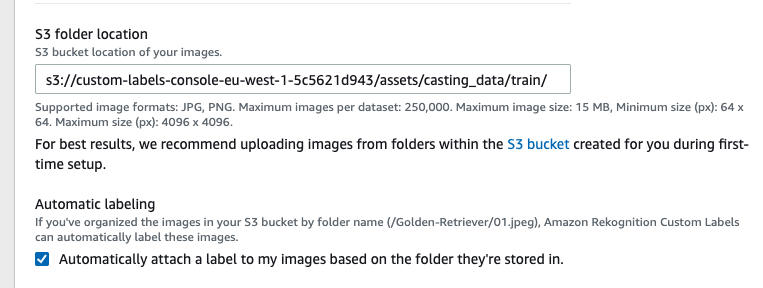
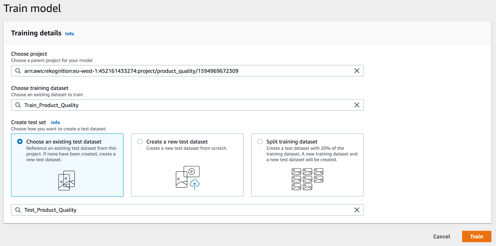

# Amazon Web Service Automated Quality Inspection

## Amazon Rekognition

Using Amazon Rekognition Custom Labels.

Custom labels available in the Ireland region (eu-west-1).

1. First time setup -> rekognition create S3 bucket -> In our case: 
custom-labels-console-eu-west-1-5c5621d943

1. Create a project -> contains all the "management" details about images, labels and models

1. Create a dataset -> Automatically add labels based on folder names
[] Command to upload images to S3 via CLI
[] Otherwise drop and drop "casting_data" from the data folder into the S3 Bucket via AWS console.
Import the images from Amazaon S3 Bucket

We can inspect the dataset within the AWS Rekognition UI.

We will do the same with the test dataset and provide the S3 folder location as S3://$BUCKET/assets/casting_data/train
Finally the project overview should look like the following:

Start the training:

Downsides:
- Not possible to select time of training. Explain costs here
TODO: is there a notification after the training has finished?